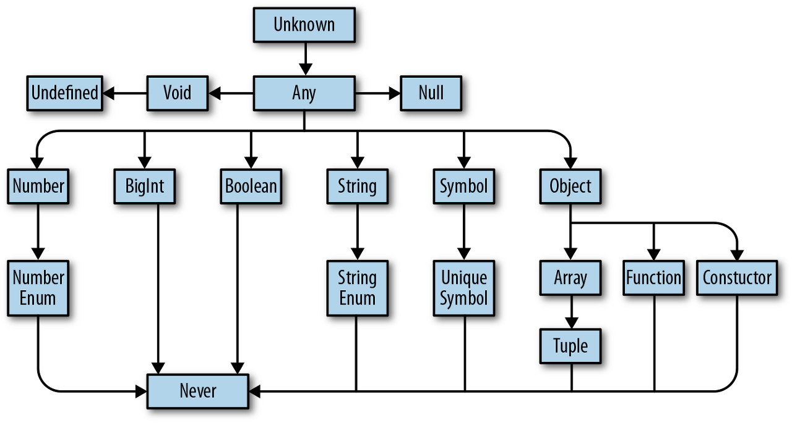

# 3장 고급 타입

## 3.1 타입스크립트만의 독자적 타입 시스템



### 3.1.1 any 타입

- 자바스크립트에 존재하는 모든 값을 오류 없이 받음.
- 타입 명시하지 않은 것과 동일한 효과.
- 동적 타이핑으로 돌아가는 것과 비슷한 결과
- 지양해야할 습관!

```ts
let state: any;

state = { value: 5 };
state = 100;
state = "hello world";
state.foo.bar = () => console.log("hello world");
```

- 그럼에도 불구하고 어쩔 수 없이 사용해야 할 때
  - 개발 단계에서 임시로 값을 지정해야 할 때
  - 어떤 값을 받아올지 또는 넘겨줄지 정할 수 없을 때

    ```ts
    type FeedbackModalParams = {
      show: boolean;
      content: string;
      cancelButtonText?: string;
      confirmButtonText?: string;
      beforeOnClose?: () => void;
      action?: any; // 모달창을 그릴 때 실행될 함수
    }
    ```

  - 값을 에측할 수 없을 때 암묵적 사용

    ```ts
    async function load() {
      const response = await fetch("https://api.example.com/data");
      const data = await response.json(); // Promise<any>로 타입 추론됨
      return data;
    }
    ```

### 3.1.2 unknown 타입

- `any`보다 안전한 타입. 실제 사용 전에는 타입 확인이 필요.
- `any` 타입 외에 다른 타입으로 할당 불가능.
- 런타임에 타입 추론이 안되면 에러를 발생시킴.
- 타입 검사를 강제하고 타입이 식별된 후에 사용할 수 있음.

```ts
let unknownValue: unknown;

unknownValue = 123;
unknownValue = "hello";
unknownValue = () => console.log("hello world");
// any 타입과 비슷하게 숫자든, 문자든, 함수든 다 할당 가능하지만

let someValue: any = unknownValue; // ⭕ any 타입으로 선언된 변수는 할당 가능
let someValue2: number = unknownValue; // ❌ 
let someValue3: string = unknownValue; // ❌
let someValue4: () => void = unknownValue; // ❌

```

### 3.1.3 void 타입

- 함수에서 반환값이 없을 때 사용.

```ts
function log(message: string): void {
  console.log(message);
}
```

### 3.1.4 never 타입

- 절대 반환되지 않는 함수에 사용. 주로 에러 던지기나 무한 루프에 사용.
- 모든 타입의 하위 타입

```ts
function fail(): never {
  throw new Error("예외 발생");
}

function checkStatus(): never {
  while (true) {}
}
```

### 3.1.5 Array 타입

- 기본 배열 타입 선언: string[], Array<number> 두 가지 방식 가능. 

```ts
let names: string[] = ["Alice", "Bob"];
let nums: Array<number> = [1, 2, 3];
```

- 유니온 타입 활용해서 다양한 자료형 다루기

```ts
let values: (string | number)[] = [1, "hello"];
```

- 튜플 타입 활용해서 배열의 길이 제한 추가하기

```ts
let tuple: [number]= [1];
tuple = [1, 2] // ❌ 
tuple = [1, "string"] // ❌
let tuple: [string, number] = ["hello", 123];
```

- 배열은 사전에 허용하지 않은 타입이 서로 섞이는 것을 방지하여 타입 안정성을 제공함.
- 튜플은 길이까지 제한하여 원소 개수와 타입을 보장함. (대표적인 예 : `useState` 훅)

> 📝 옵셔널(Optional)
>
> - 옵셔널 타입은 값이 있을 수도 있고 없을 수도 있음을 나타내는 타입
> - 선택적 프로퍼티를 표현하는 데 사용
>
> ```ts
> const optionalTuple: [number, number, number?] = [1,2];
> ```
>

### 3.1.6 enum 타입

- 열거형
- 의미 있는 이름을 가진 상수 집합을 정의할 때 사용. (문자열 상수)
- 응집력 있는 집합 구조체

```ts
enum ItemStatusType {
  DELIVERY_HOLD = 'DELIVERY_HOLD',
  DELIVERY_READY = 'DELIVERY_READY',
  DELIVERING = 'DELIVERING',
  DELIVERED = 'DELIVERED'
}

const checkItemAvailable = (itemStatus: ItemStatusType) =>{
  switch(itemStatus){
    case ItemStatusType.DELIVERY_HOLD:
    case ItemStatusType.DELIVERY_READY:
    case ItemStatusType.DELIVERING:
      return false;
    case ItemStatusType.DELIVERED:
      return true;
  }
}
```

- 장점
  - 타입 안정성
  - 명확한 의미 전달, 높은 응집력
  - 가독성

- 단점
  - 숫자로만 이루어지거나, 타입스크립트가 자동으로 추론한 열거형의 경우 안전하지 않음.
  - `const enum`으로 선언해도, 숫자형 상수로 관리되는 `enum`은 선언값 이외의 값을 할당해도 이를 막지 못한다.
  - 문자열 상수 방식은 조금 더 안전.

```ts
const enum NUMBER {
  ONE = 1,
  TWO = 2,
}

const myNumber: NUMBER = 3; // enum에 정의되지 않았지만, 숫자형 enum은 컴파일 시점에 인라인 처리되어 타입 오류가 발생하지 않을 수 있다.

const enum STRING = {
  ONE = 'ONE',
  TWO = 'TWO'
}

const myString: STRING = 'THREE'; // Error
```

- 열거형은 값 공간, 타입 공간에서 모두 사용됨
- 이때 ts -> js로 변환시 즉시실행함수(IIFE) 형식으로 변환되는데
- 일부 번들러에서 트리쉐이킹 과정 중 인식 못하는 경우가 발생하기도 함
- 불필요한 코드 크기가 증가할 수 있음
- 따라서 `const enum` 또는 `as const` 단언을 사용하는 것을 권장

## 3.2 타입 조합

### 3.2.1 교차 타입 (Intersection Type)

- 여러 타입을 합쳐서 하나의 타입으로 정의.
- `&` 연산자 사용
- A 타입과 B 타입을 모두 만족하는 경우!

```ts
type ProductItem = {
  id: number;
  name: string;
  type: string;
  price: number;
  imageUrl: string;
  quantity: number;
}

type ProductItemWithDiscount =  ProductItem & { discountAmount: number}
```

### 3.2.2 유니온 타입 (Union Type)

- 둘 중 하나의 타입을 가질 수 있음.
- `|` 연산자 사용
- A 타입 또는 B 타입 중 하나!

```ts
type CardItem = {
  id: number;
  name: string;
  type: string;
  imageUrl: string;
}

type PromotionEventItem = ProductItem | CardItem; 
// 이벤트 프로모션 대상은 상품일 수도 있고, 카드 일 수도 있다.

const printPromotionItem = (item: PromotionEventItem) => {
  console.log(item.name);

  console.log(item.quantity); // 🚨 Compile Error 
  // quantity는 ProductItem에만 존재한다.
  // CardItem 타입도 item이 될 수 있는데, CardItem에는 quantity가 존재하지 않는다.
}
```

### 3.2.3 인덱스 시그니처 (Index Signatures)

- 동적 키를 갖는 객체 타입 정의.
- `[Key: K]: T` 형태
  - 의미: 이 객체의 키 값은 모두 K 타입이어야 하고, 속성 값(value)은 T 타입이어야 한다.

```ts
interface Dictionary {
  [key: string]: string;
}

const dict: Dictionary = {
  hello: "안녕",
  world: "세계"
};
```

```ts
interface Person {
  [key: string]: number | boolean;
  length: number;
  isValid: boolean;
  name: string; // ❌ Error : Property 'name' of type 'string' is not assignable to 'string' index type 'number | boolean'.
}
```

### 3.2.4 인덱스드 엑세스 타입 (Indexed Access Types)

- 타입에서 특정 속성의 타입을 추출.

```ts
type User = { 
  name: string;
  age: number;
};

type UserName = User["name"]; // string
type UserAge = User["age"]; // number

type UserKeys = keyof User; // "name" | "age"

type UserValues = User[keyof User]; // string | number

```

- 배열의 경우

```ts
const PromotionList = [
  { type: 'product', name: '피자', price: 10000 },
  { type: 'product', name: '치킨', price: 15000 },
  { type: 'card', name: '힘내!', price: 20000 },
]

type PromotionItemType = typeof PromotionList[number];

```

### 3.2.5 맵드 타입 (Mapped Types)

- 기존 타입을 반복적으로 변환하여 새로운 타입 생성.

```ts
type Optional<T> = {
  [K in keyof T]?: T[K];
};

type User = { name: string; age: number };
type PartialUser = Optional<User>; // 모든 속성이 optional
```

### 3.2.6 템플릿 리터럴 타입 (Template Literal Types)

- 문자열 조합으로 타입 생성 가능.

```ts
type Lang = "ko" | "en";
type MessageKey = `msg_${Lang}`; // "msg_ko" | "msg_en"
```

### 3.2.7 제네릭 (기본 개념 소개)

- 타입을 함수처럼 인자로 받아 재사용 가능한 타입 생성.

```ts
function wrap<T>(value: T): { value: T } {
  return { value };
}

```

## 3.3 제네릭 사용법

### 3.3.1 함수의 제네릭

```ts
function identity<T>(arg: T): T {
  return arg;
}
```

### 3.3.2 호출 시그니처의 제네릭

```ts
type Mapper<T> = (x: T) => T;

const double: Mapper<number> = (x) => x * 2;
```

### 3.3.3 제네릭 클래스

```ts
class Container<T> {
  private _value: T;
  constructor(value: T) {
    this._value = value;
  }
  get value(): T {
    return this._value;
  }
}
```

### 3.3.4 제한된 제네릭 (extends)

```ts
function getLength<T extends { length: number }>(value: T) {
  return value.length;
}
```

### 3.3.5 확장된 제네릭

- 제네릭 타입끼리 조합하거나 중첩해서 더 복잡한 타입 구현.

```ts
function merge<T extends object, U extends object>(a: T, b: U): T & U {
  return { ...a, ...b };
}
```

### 3.3.6 제네릭 예시 (오용 사례 포함)

- 굳이 제네릭을 쓰지 않아도 되는 경우:

```ts
function noNeed<T>(value: string): string {
  return value;
}
```

- 제네릭 불필요. 그냥 string으로 선언하면 됨.

```ts
function parseJSON(json: string): any {
  return JSON.parse(json);
}

```

- 가독성을 해치는 제네릭

```ts
function complex<T extends keyof any, U extends Record<T, any>>(k: T, o: U): any {
  return o[k];
}
```

- 너무 과도한 제네릭은 읽기 어렵고 유지보수 힘듦
